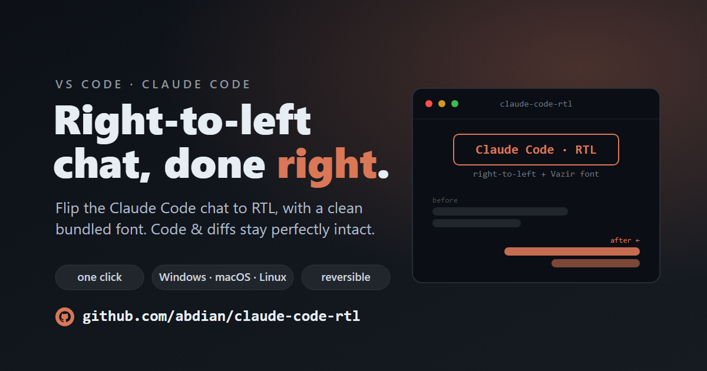

<div align="center">



# Claude Code · RTL

**English** · [فارسی](README.fa.md)

**Make the [Claude Code](https://www.anthropic.com/claude-code) VSCode chat render right‑to‑left, with a clean bundled font (Vazir).**

Works on **Windows · macOS · Linux** — the installer auto‑detects your OS.

[](LICENSE)


</div>

---

## What it does

The Claude Code chat is an English‑first, left‑to‑right webview. If you write in
Arabic, Hebrew, Persian, or any RTL script, it reads awkwardly. This tool makes the
whole conversation right‑to‑left — cleanly:

- turns **the replies, your own messages, the prompt box, and the option dialogs** RTL,
- keeps **code, diffs and Monaco editors LTR** so nothing renders broken,
- the prompt box is **auto‑directional** — Persian lines go RTL, code/English stays LTR,
- bundles a clean **Vazir** font (affects only the chat panel),
- is **idempotent**, **reversible**, and **re‑applies itself after every update**.

---

## Install — one line

> **Requires** the [Claude Code](https://www.anthropic.com/claude-code) extension already installed in VSCode. (The installer checks and tells you if it's missing.)

**macOS / Linux** — paste in a terminal:

```bash
curl -fsSL https://raw.githubusercontent.com/abdian/claude-code-rtl/main/install.sh | bash
```

**Windows** — paste in PowerShell:

```powershell
irm https://raw.githubusercontent.com/abdian/claude-code-rtl/main/install.ps1 | iex
```

That's it — it installs, applies, and turns on auto‑apply. **Last step:** reload VSCode
with `Ctrl`/`Cmd` `Shift` `P` → **Developer: Reload Window**.

No clone, no `chmod`, no Gatekeeper, and **Windows needs no Git**.

<details>
<summary>Prefer to download the repo and use a menu instead?</summary>

Clone or download the ZIP, then:

- **Windows** — double‑click **`install-windows.cmd`** _(needs [Git for Windows](https://git-scm.com/download/win))_.
- **macOS** — `chmod +x install-macos.command scripts/*.sh` once, then double‑click **`install-macos.command`** (if Gatekeeper blocks it: right‑click → **Open**).
- **Linux** — `bash scripts/menu.sh`.

This opens an interactive menu (apply, change font, auto‑apply, reset). Then reload the VSCode window.

</details>

---

## Uninstall — one line

**macOS / Linux:**
```bash
curl -fsSL https://raw.githubusercontent.com/abdian/claude-code-rtl/main/uninstall.sh | bash
```
**Windows:**
```powershell
irm https://raw.githubusercontent.com/abdian/claude-code-rtl/main/uninstall.ps1 | iex
```

---

## The menu

The macOS/Linux install and the download method include an interactive menu. Reopen it
anytime with `bash ~/.claude-code-rtl/scripts/menu.sh`. _(The Windows one‑liner is
menu‑less by design — just re‑run the install/uninstall commands above.)_

```
   ╭────────────────────────────╮
   │      Claude Code · RTL      │
   ╰────────────────────────────╯
   right-to-left  +  Vazir font

   [1] Apply now                 RTL + font  (also turns on auto-apply)
   [2] Change font               Vazir / system   (has a Back option)
   [3] Enable / Disable auto-apply
   [4] Reset to original         remove everything
   [0] Exit
```

---

## Auto‑apply after updates

When Claude Code updates, VSCode installs it into a **new folder** and the patch is
gone. The installer sets up auto‑apply that re‑applies **both at login and when the
extension changes** — so RTL comes back on its own, no reinstall:

| OS      | At login              | When the extension updates          |
|---------|-----------------------|-------------------------------------|
| macOS   | LaunchAgent `RunAtLoad` | launchd `WatchPaths` (instant)    |
| Windows | Startup `.vbs`        | scheduled task every 10 min         |
| Linux   | autostart `.desktop`  | systemd user `path` unit (instant)  |

None require admin/root. When the extension itself updates, VSCode asks you to reload
once — by then the patch is already back in place, so RTL is there.

---

## Fonts & licensing

- **Vazir** ships with the repo (`fonts/Vazir-Variable.ttf`) under the **SIL Open
  Font License** — free to redistribute. It is the only bundled font.
- Want a different font? Drop its `.ttf` into `fonts/` and point it in the menu.
  **Don't commit proprietary fonts** to a public repo — `.gitignore` already blocks
  the common ones.

---

## How it works

There is **no supported way** for one VSCode extension to style another extension's
webview — it's a sandboxed `<iframe>`. So this patches Claude Code's own stylesheet
on disk:

```
~/.vscode/extensions/anthropic.claude-code-*/webview/index.css
```

A small, clearly‑marked CSS block is appended (and the font copied next to it, because
the webview's CSP only allows fonts from the extension folder). RTL is scoped to the
**text surfaces** — replies, your messages, the prompt box and dialogs — via stable
hooks, and code, diffs and Monaco editors are forced back to LTR so nothing renders
broken.

## Repo layout

```
install.sh / install.ps1     one-line installers (curl … | bash  /  irm … | iex)
uninstall.sh / uninstall.ps1  one-line uninstallers
install-windows.cmd           manual: double-click on Windows (needs Git)
install-macos.command         manual: double-click on macOS
scripts/
  menu.sh                     interactive menu (the UI)
  apply.sh                    bash engine: patch / --revert (also run by auto-apply)
  apply.ps1                   PowerShell engine (Windows, Git-free path)
fonts/Vazir-Variable.ttf
```

## License

- Project code (scripts & launchers): **MIT** — see [`LICENSE`](LICENSE).
- Bundled **Vazir** font: **SIL Open Font License 1.1** — see [`fonts/LICENSE-Vazir.txt`](fonts/LICENSE-Vazir.txt).

<div align="center"><sub>Not affiliated with Anthropic. Patches local files only; nothing is uploaded.</sub></div>
